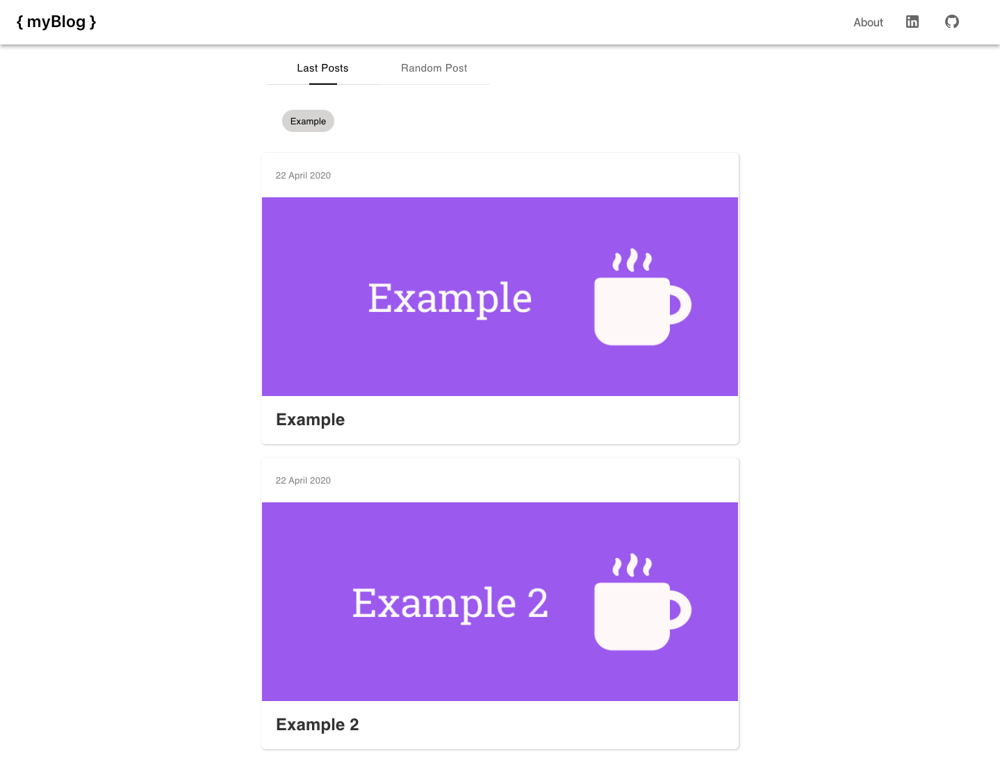
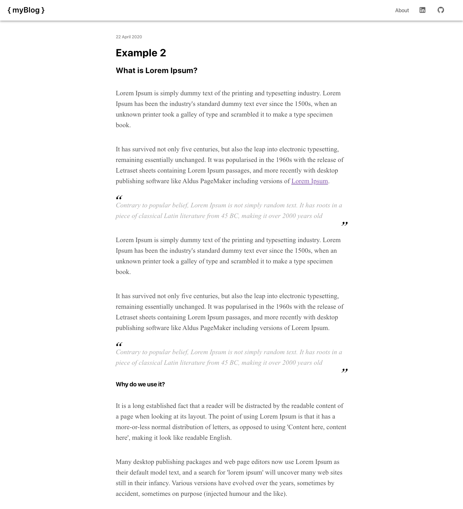
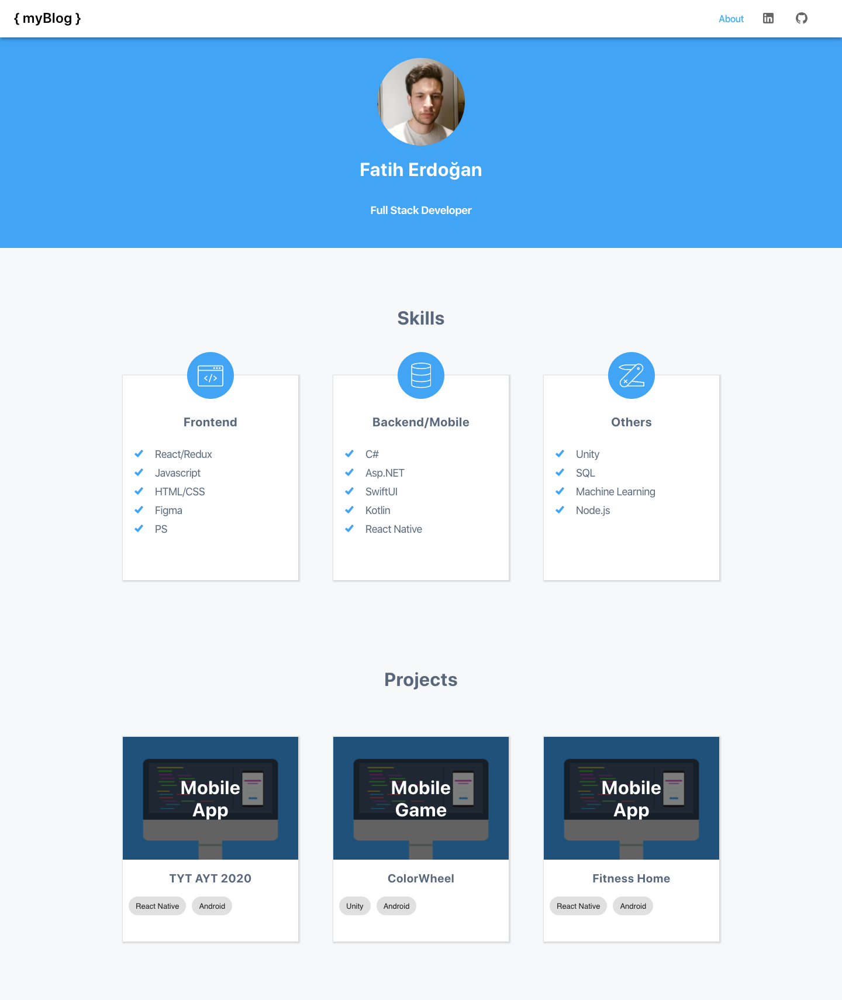

## Simple React Responsive Markdown Blog Project

 `yarn install`
 `yarn start`

Open [http://localhost:3000](http://localhost:3000) to view it in the browser.

### Last Post 

### Blog Detail

### About
                  